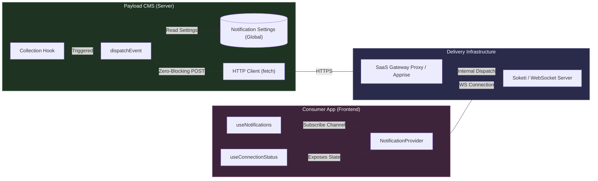
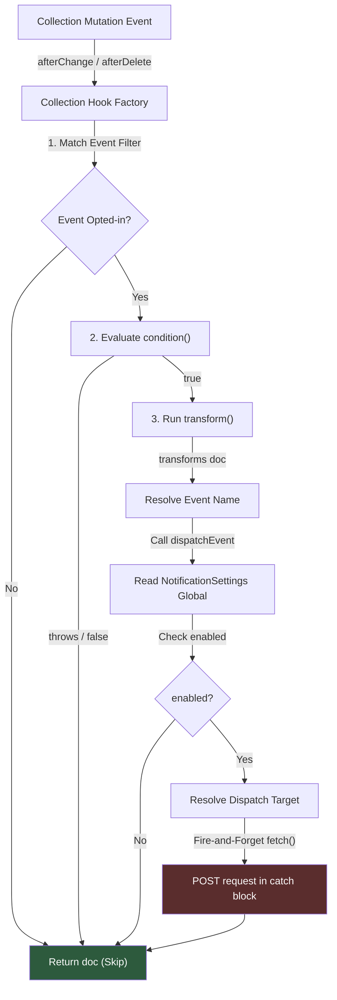
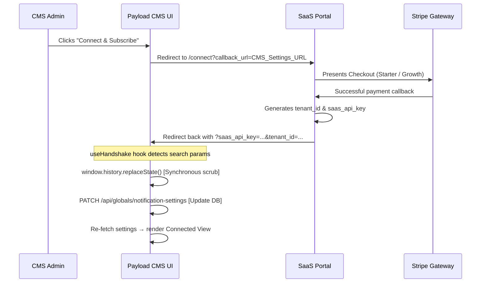
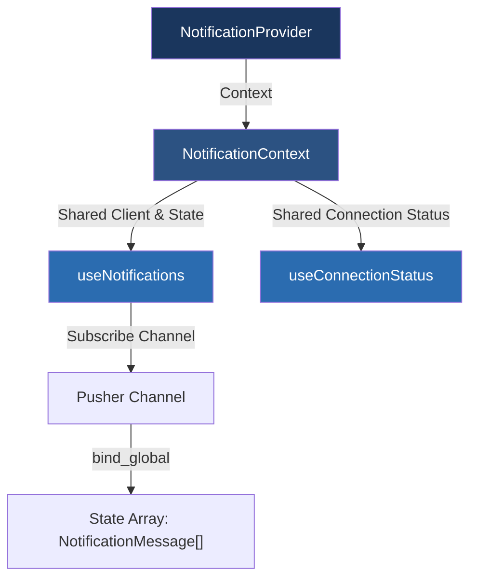
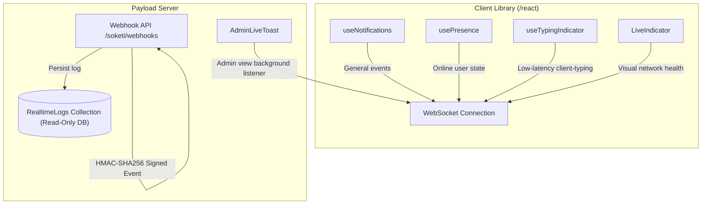

# Code Architecture

This document details the code architecture of the `payload-plugin-realtime-notifications` plugin. It outlines how the central event pipeline flows, how hooks are triggered and parsed, and how the client and server components communicate.

---

## 1. Overall System Architecture

The plugin is designed to operate on two primary boundaries:
1. **The Server Boundary (Payload CMS):** Processes content edits, determines if events should dispatch, and pushes payloads asynchronously to either a SaaS Gateway proxy or self-hosted systems.
2. **The Client Boundary (Consumer App):** Listens to events using a WebSocket client connected directly to the WebSocket host (either Soketi or the SaaS endpoint).

### System Topology Diagram



---

## 2. Server-Side Execution Flow (Phase 1)

When a database mutation occurs (e.g. document updated/created/deleted), Payload invokes registered collection hooks. The plugin inserts specialized `afterChange` and `afterDelete` hooks.

### Execution Sequence



### Core Architecture Rules Applied:
1. **Stateless Operations:** Hooks do not persist WebSocket connection objects. They act strictly as event publishers using standard HTTP endpoints.
2. **Zero-Blocking Performance:** The fetch sequence in `dispatchEvent` is detached from the hook execution context. The promise chain is explicitly ignored (`void` operator), preventing the Payload database save cycle from blocking on network resolutions.

---

## 3. The Custom Admin Dashboard & Handshake (Phase 2)

To connect the CMS to the SaaS billing gateway, a custom React component dashboard overrides the default admin edit view for the `notification-settings` Global.

### Handshake Callback Flow



### Key Security Design:
- **Synchronous URL Purge:** The `useHandshake` hook executes `window.history.replaceState` synchronously immediately upon detecting the search params. This removes sensitive API keys from the URL *before* starting the asynchronous REST fetch saving the keys to the database, protecting the key from trailing history or referer header leakage.

---

## 4. Frontend Client Architecture (Phase 4)

The consumer app's frontend communicates with the WebSockets layer through hooks exported from `payload-plugin-realtime-notifications/react`.



### Decoupled Import Isolation:
To guarantee that the frontend bundles contain zero Payload server dependencies (e.g. database tools, admin UI modules), the React client hooks are exported via a clean, package-level export subpath:

```json
"exports": {
  "./react": {
    "import": "./dist/exports/react.js",
    "types": "./dist/exports/react.d.ts",
    "default": "./dist/exports/react.js"
  }
}
```
This forces compilation loaders to only tree-shake and bundle `react` and `pusher-js` client code.

---

## 5. Real-Time SDK & Developer Experience Extensions

To enable rapid building of collaborative real-time apps, the plugin includes advanced client-side utilities and server-side tracking:



### Key Extended Components:
1. **`usePresence(channelName)`**: Subscribes to a Pusher Presence Channel (prefixed with `presence-`). It monitors `pusher:subscription_succeeded`, `pusher:member_added`, and `pusher:member_removed` events, maintaining a synchronized dictionary of active user IDs and metadata in React state.
2. **`useTypingIndicator(channel, localIdentifier)`**: Emits `client-typing` events directly through the WebSocket client to bypass database writes. It automatically throttles outgoing broadcasts (maximum 1 per second) and cleans up stale indicators via a 1.5s interval sweep.
3. **`RealtimeLogs` Collection**: A read-only Payload database collection that acts as a secure, permanent audit log of all channel traffic, occupied status, and client disconnects received from the verified webhook API.
4. **`LiveIndicator` & `AdminLiveToast`**: Instant UI helpers. `LiveIndicator` binds to connection state changes to render a glowing status dot. `AdminLiveToast` plugs into the Payload Admin UI sidebar to alert logged-in users of high-priority system alerts in real-time.

