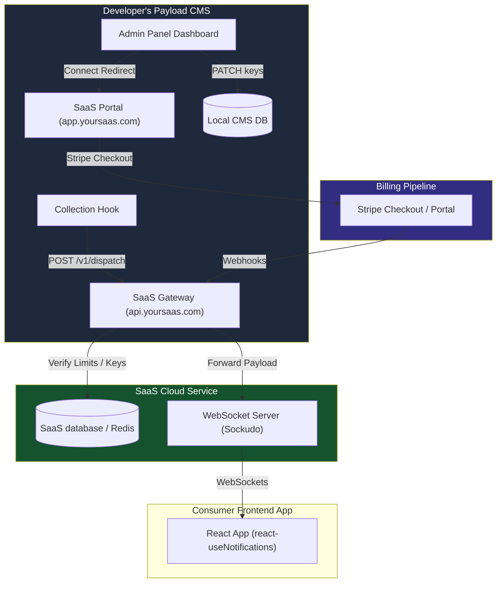

# SaaS Infrastructure & Integration Guide

This guide details how to build and configure the SaaS cloud infrastructure to power the `payload-plugin-realtime-notifications` plugin. It outlines the step-by-step setup required so developers can sign up, subscribe via Stripe, and seamlessly connect their Payload CMS admin panel to your service.

---

## 1. SaaS System Architecture Overview

The SaaS infrastructure consists of three main components:
1. **SaaS Web Portal (`app.yoursaas.com`):** A Next.js/React app where developers sign up, select a subscription tier, manage billing via Stripe, and view credentials.
2. **SaaS Gateway API (`api.yoursaas.com`):** The central HTTP server that handles API key verification, routes client usage requests, processes Stripe webhooks, and proxies notifications to WebSockets.
3. **WebSocket Cluster (Pusher-compatible / Sockudo):** Manages active WebSockets connections from consumer frontend clients.



---

## 2. Step-by-Step Setup Checklist

### Step 1: Set Up SaaS Databases
You need a persistent database (e.g., PostgreSQL or MongoDB) for accounts and a fast cache database (Redis) for tracking real-time usage/rate limits.

* **Account Schema Requirements:**
  - `userId` (Primary Key)
  - `email`
  - `stripeCustomerId` (nullable)
  - `tenantId` (UUID, unique index)
  - `saasApiKey` (hashed or encrypted index)
  - `plan` (e.g. `'free'`, `'starter'`, `'growth'`)
* **Redis Counter Strategy:**
  - Track usage monthly using Redis keys structured by tenant and month: `usage:{tenantId}:{YYYY-MM}:websocket` and `usage:{tenantId}:{YYYY-MM}:push`.

### Step 2: Configure Stripe Products and Webhooks
1. **Create Products in Stripe:**
   - Create a product for each tier (e.g. *Starter*, *Growth*).
   - Configure monthly recurring Prices. Note down the **Stripe Price IDs** (e.g., `price_1Oxx...`).
2. **Setup Stripe Webhooks:**
   - Configure a webhook endpoint in Stripe pointing to `https://api.yoursaas.com/v1/stripe/webhook`.
   - Listen to the following events:
     - `checkout.session.completed`: Upgrades the user account and generates active API Keys.
     - `customer.subscription.deleted`: Downgrades the account to `free` or disables the tenant's keys.
     - `customer.subscription.updated`: Syncs active plan updates.

### Step 3: Implement OAuth Handshake Redirection (`/connect`)
In the SaaS Web Portal, build the route `GET /connect` that prompts users to login/register and then redirects them to pay.

1. **Capture Callback URL:**
   - The user is redirected from the CMS Admin panel with the query param `?callback_url=...`. Store this URL in the browser session or state.
2. **Prompt Sign-up & Stripe Checkout:**
   - If not authenticated, prompt sign-up.
   - Redirect the user to a Stripe Checkout Session for the selected plan tier.
3. **Generate Keys on Success:**
   - Upon successful Stripe Payment completion, query your SaaS database:
     - Check if the user already has a `tenantId` and `saasApiKey`. If not, generate them:
       - `tenantId`: Generate a standard UUID (e.g. `123e4567-e89b-12d3-a456-426614174000`).
       - `saasApiKey`: Generate a secure random prefix token (e.g. `sk_live_5e8e...`).
4. **Redirect back to CMS:**
   - Construct the redirection URL using the captured `callback_url`:
     ```
     {callback_url}?saas_api_key={saasApiKey}&tenant_id={tenantId}
     ```
   - Redirect the developer's browser back to this URL.

---

## 3. Implementing the SaaS Gateway API Endpoints

The SaaS Gateway (`api.yoursaas.com`) must implement three critical endpoints to integrate directly with the CMS dashboard UI.

### 1. The Dispatch Proxy: `POST /v1/dispatch`
Invoked automatically by the Payload collection hooks.

* **Headers:** `Authorization: Bearer {saasApiKey}`
* **Execution Flow:**
  1. Parse the Bearer token and find the matching tenant/user in your database.
  2. If tenant does not exist, return `401 Unauthorized`.
  3. Query current month usage count from Redis (e.g., `usage:{tenantId}:{YYYY-MM}:websocket`).
  4. Compare the usage count to the user's plan tier limits. If exceeded, return `429 Too Many Requests`.
  5. Increment the Redis usage counter: `INCR usage:{tenantId}:{YYYY-MM}:websocket`.
  6. Forward the event payload internally to your Sockudo / WebSocket cluster.
  7. Return `200 OK`.

### 2. Tenant Usage Metrics: `GET /v1/tenant/usage`
Invoked by the CMS Connected Dashboard UI to render the progress bars.

* **Headers:** `Authorization: Bearer {saasApiKey}`
* **Response Shape (`UsageData`):**
  ```json
  {
    "plan": "Growth",
    "websocketCount": 4200,
    "websocketLimit": 100000,
    "pushCount": 150,
    "pushLimit": 5000
  }
  ```

### 3. Stripe Portal Session: `POST /v1/tenant/portal-session`
Invoked when the admin clicks the "Manage Billing" button in the CMS.

* **Headers:** `Authorization: Bearer {saasApiKey}`
* **Execution Flow:**
  1. Retrieve the matching tenant's `stripeCustomerId` from the database.
  2. Call the Stripe SDK to generate a portal session:
     ```javascript
     const session = await stripe.billingPortal.sessions.create({
       customer: stripeCustomerId,
       return_url: 'https://api.yoursaas.com/v1/tenant/portal-return-redirect', 
       // This endpoint should redirect back to the CMS setting view
     });
     ```
  3. Return the session URL:
     ```json
     { "url": "https://billing.stripe.com/p/session/..." }
     ```

---

## 4. How the Plugin Integrates from the Admin UI

When the developer installs your plugin, here is exactly how your SaaS portal interacts with the CMS interface:

1. **Initiate Handshake:**
   - The developer clicks the **Connect & Subscribe** button in their Payload Admin Panel.
   - The dashboard routes them to:
     `https://app.yoursaas.com/connect?callback_url=http://localhost:3000/admin/globals/notification-settings`
2. **Authorize and Pay:**
   - They subscribe to your billing plan.
3. **Deliver Credentials:**
   - Your SaaS portal redirects them back to:
     `http://localhost:3000/admin/globals/notification-settings?saas_api_key=sk_live_123&tenant_id=tenant_abc`
4. **Scrub & Save:**
   - The plugin's `useHandshake` React hook intercepts the URL, executes `replaceState` to hide the parameters immediately, and submits a `PATCH /api/globals/notification-settings` internally to the local Payload server database.
5. **Polled Verification:**
   - The dashboard re-fetches configuration settings and now displays the subscription statistics (usage progress meters) fetched from your gateway's `/v1/tenant/usage` API.
