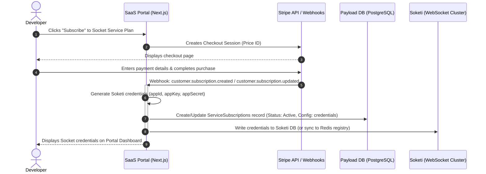
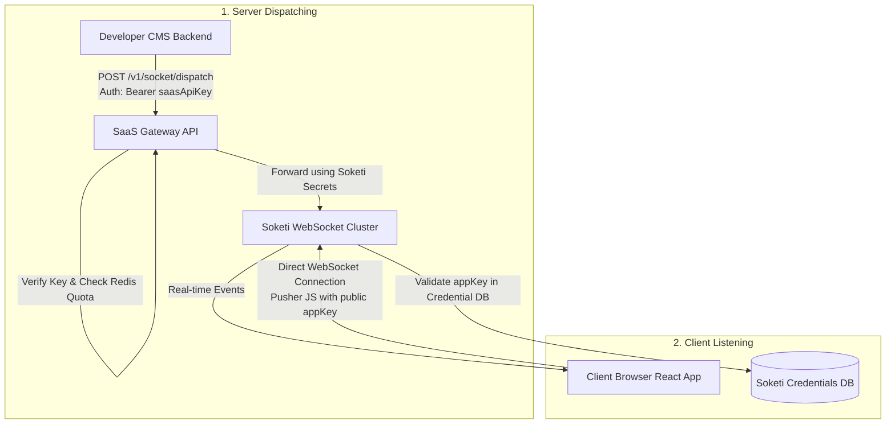
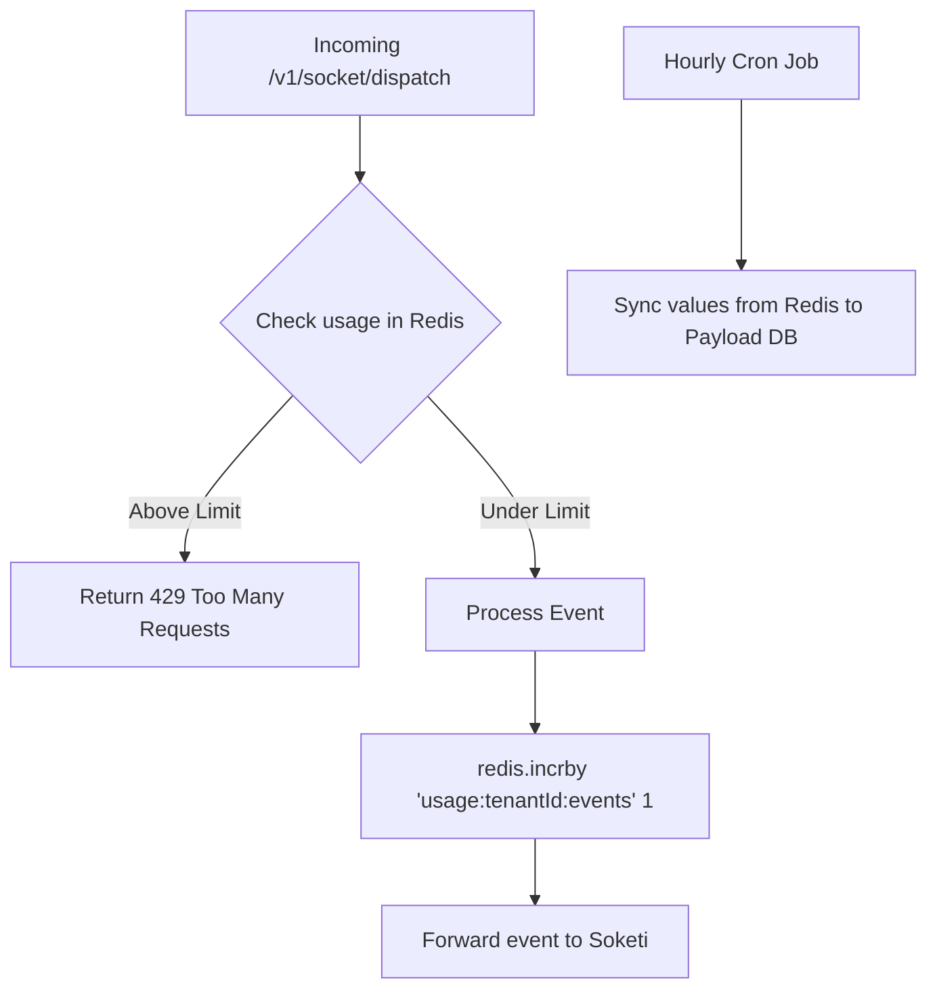
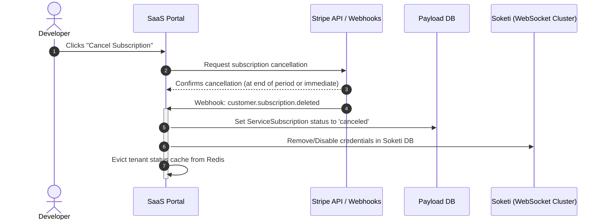

# Socket Service Lifecycle Workflow: Subscription, Auth, Quotas, and Cancellation

This document explains the technical lifecycle of a tenant subscribing to, using, and canceling the **Socket & Notification Service** on the SaaS Provider Portal, including code mappings across both server dispatching and client WebSocket listening.

---

## 1. Subscription & Provisioning Flow

When a user upgrades or subscribes to the Socket & Notification Service:



### Technical Details of Provisioning:
- **Credential Generation:** The portal generates a cryptographically secure `appId` (uuid/random string), `appKey`, and `appSecret`.
- **Soketi Integration:** Soketi can be configured to read its application credentials from a database (like PostgreSQL/MySQL) or Redis. The SaaS Portal writes the new app credentials directly into Soketi’s database/Redis instance upon receiving the successful Stripe webhook.

---

## 2. Authentication & Architecture Flow

There are two distinct channels of communication and authentication in the system:

1. **Server-to-Server (API Gateway Event Dispatching):** When the developer's CMS backend sends/dispatches notification events.
2. **Client-to-Server (Direct WebSockets):** When end-user browsers connect directly to Soketi over WebSockets to receive real-time updates.



---

### A. Server-to-Server Dispatching (Code Mapping)

* **Code Reference:** `src/dispatcher/dispatchEvent.ts`

When a server event is dispatched inside the CMS, the behavior depends on the selected `mode`:

* **SaaS Mode (`settings.mode === 'saas'`):**
  * The plugin sends an HTTP `POST` to the SaaS Gateway endpoint (default: `https://api.yoursaas.com/v1/dispatch`) using `Authorization: Bearer <saasApiKey>`.
  * The gateway validates the `saasApiKey`, checks quota limits in Redis, resolves the tenant's internal Soketi credentials, and forwards the event to Soketi.
  ```typescript
  // src/dispatcher/dispatchEvent.ts
  if (settings.mode === 'saas') {
    if (settings.saasApiKey) {
      targets.push({
        url: `${baseUrl}/dispatch`,
        headers: { Authorization: `Bearer ${settings.saasApiKey}` },
        body: JSON.stringify(event),
      })
    }
    return targets
  }
  ```
* **Self-Hosted Mode (`settings.mode === 'self-hosted'`):**
  * The plugin signs the payload using `soketiAppKey` + `soketiAppSecret` (`signPusherRequest()`) and posts directly to Soketi's HTTP API (`/apps/<appId>/events`).

---

### B. Client-to-Server WebSocket Connection (Code Mapping)

Client-side WebSocket connection handling and event listening are implemented across the following modules:

#### 1. Connection Initialization: `src/realtime/NotificationProvider.tsx`
The `<NotificationProvider>` component initializes the WebSocket connection using `pusher-js` directly in the browser:

```typescript
// src/realtime/NotificationProvider.tsx (lines 117-128)
pusher = new PusherConstructor(config.appKey, {
  cluster: config.cluster ?? 'mt1',
  wsHost: config.wsHost,
  wsPort: config.wsPort,
  wssPort: config.wssPort,
  forceTLS: config.forceTLS ?? true,
  enabledTransports: config.enabledTransports ?? ['ws', 'wss'],
  ...(config.authEndpoint ? { authEndpoint: config.authEndpoint } : {}),
})
```

#### 2. Layout Configuration: `dev/app/(frontend)/layout.tsx`
The application frontend fetches settings from Payload CMS and feeds `clientConfig` into `<NotificationProvider>`:

```typescript
// dev/app/(frontend)/layout.tsx (lines 20-34)
const clientConfig: NotificationClientConfig =
  settings.mode === 'self-hosted'
    ? {
        appKey: settings.soketiAppKey ?? 'app-key',
        wsHost: cleanHost,
        wsPort: settings.soketiPort ?? 6001,
        forceTLS: true,
        authEndpoint: '/api/soketi/auth',
      }
    : {
        appKey: saasAppKey, // Provided via SaaS Gateway / auto-enrollment
        cluster: 'mt1',
      }
```

#### 3. Channel Subscription & Event Binding: `src/realtime/useNotifications.ts`
The `useNotifications()` hook subscribes to channels and binds event listeners:

```typescript
// src/realtime/useNotifications.ts (lines 69-101)
// 1. Subscribe to channel
const pusherChannel = client.subscribe(channel)

// 2. Bind to specific named events
pusherChannel.bind(eventName, (data) => { ... })

// 3. Bind globally to all channel events
pusherChannel.bind_global((eventName, data) => { ... })
```

#### 4. Specialized Real-Time Hooks:
* **Presence (`src/realtime/usePresence.ts`):** Listens to `pusher:member_added` and `pusher:member_removed` events.
* **Typing Indicators (`src/realtime/useTypingIndicator.ts`):** Triggers client events via `pusherChannel.trigger('client-typing', ...)` and listens to peer typing events.

---

## 3. Quota Calculation & Enforcement

To enforce event limits efficiently without straining the main database with constant writes, we use a Redis caching layer.



### Quota Enforcement Process:

1. **Low-Latency Verification:** When a dispatch request is received, the Gateway performs a single `GET` in Redis: `usage:tenant_id:socket-notification:current_month`.
2. **Comparison:** If the value exceeds the quota limit defined in the tenant's `ServicePlan` (e.g., `100,000` events), the gateway immediately responds with a `429 Too Many Requests` status, avoiding the execution of the Soketi event broadcast.
3. **Tracking & Increments:** If under the limit, the gateway increments the count in Redis via `INCR` or `INCRBY` (an atomic, high-performance memory operation) and forwards the event.
4. **Database Synchronization:** An hourly cron job syncs the aggregated values from Redis into the `currentUsage` field in the Payload DB `ServiceSubscriptions` collection.

---

## 4. Subscription Cancellation & Access Control

When a user cancels their subscription:



### How Access is Revoked:

- **Immediate API Gateway Block:** Any incoming request to `/api/v1/socket/dispatch` will fail at the authorization check. The Gateway sees that the `ServiceSubscription` status for `socket-notification` is `canceled` and rejects the request with `403 Forbidden`.
- **Soketi Connection Revocation:**
  - When the portal receives the `customer.subscription.deleted` webhook, it deletes the Soketi credentials (`appId`, `appKey`, `appSecret`) from the Soketi database registry.
  - Soketi instantly rejects any new WebSocket connection requests using that `appKey`, as the credentials no longer exist in its database.
  - Any active WebSocket connections using the deleted key are closed by Soketi during its regular credential verification loops or when the container restarts/checks active apps.
